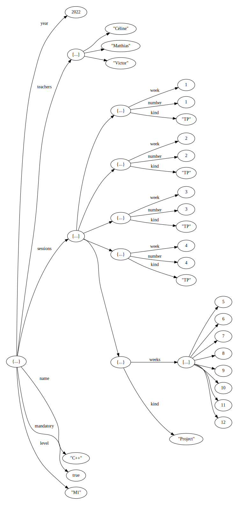

# TP4 - Héritage

Le but de ce TP est d'implémenter les classes permettant de représenter en mémoire un document JSON (JavaScript Object Notation).


## Test Driven Development

Ce TP suit à nouveau en TDD, mais cette fois on utilisera des `ctest`.  Chaque test est un programme indépendant, et il est réussi s'il s'éxecute sans erreur.  Les programmes  se trouvent dans le répertoire `tests`, et doivent être fait par ordre croissant.

Pour activer les tests, décommenter la ligne suivante du `CMakeLists.txt` à la racine du répertoire git.
```
enable_testing()
```

Après reconfiguration, une nouvelle ligne apparait dans la barre en bas de vscode.  Vous pouvez lancer la suite de tests en cliquant dessus. Vous pouvez aussi utiliser les boutons usuels (*Build*, *Run* et *Debug*) pour compiler ou éxécuter un test en particulier.


Un `ctest` est un fichier qui contient un petit programme indépendant (par exemple `tests/01_compile.cpp`), qui correspond à deux tests:
- Un test de compilation (par exemple `build:01_compile.cpp`): il est réussi si le compilateur arrive a compiler le fichier.
- Un text d'éxecution (par exemple `run:01_compile.cpp`): le test est réussi si le programme s'éxecute sans erreur.


## Documents JSON


Un document JSON ressemble typiquement à (fichier `tests/json/cpp2022.json`):
```json
{
  "name":"C++",
  "level":"M1",
  "mandatory":true,
  "teachers":["Céline","Matthias","Victor"],
  "year": 2022,
  "sessions":[
    {"kind":"TP", "number":1, "week":1},
    {"kind":"TP", "number":2, "week":2},
    {"kind":"TP", "number":3, "week":3},
    {"kind":"TP", "number":4, "week":4},
    {"kind":"Project", "weeks":[5,6,7,8,9,10,11,12]}
  ]
}
```

Une valeur JSON est soit:
1. un *booléen*, par exemple `true`;
2. un *nombre*, par exemple `2022`;
3. une *chaîne de caractère*, par exemple `"C++"`;
4. une *liste* de valeurs JSON entre `[`...`]` et séparées par des virgules, par exemple `["Céline","Matthias","Victor"]`; 
5. un *dictionnaire* entre `{`...`}` qui associe des clefs (chaîne de caractère avant le `:`) à des valeurs JSON (après le `:`), par exemple `{"kind":"Project", "weeks":[5,6,7,8,9,10,11,12]}` associe la clef `"kind"` à la valeur `"Project"`, la clef `"weeks"` à la valeur `[5,6,7,8,9,10,11,12]` 

Notez qu'on ne suppose aucune cohérence particulière de typage. Par exemple les valeurs JSON dans une liste peuvent être de types différents, par exemple `[1, "2i",{"imag":3, "real":4}]` pourrait représenter la liste des trois nombres complexes $1$, $2i$ et $3i+4$.

Un document JSON est simplement un fichier qui contient une valeur JSON, usuellement un dictionnaire. D'autres documents json se trouvent dans le dossier `json`. La plupart sont des petits exemples à des fins de tests (**ne les modifiez pas!**).  
Au contraire, le document `json/pokedex.json` est représentatif de ce à quoi ressemble un document JSON réel, et sera utilisé dans les tests plus avancés.


## Arbres

Un document peut se voir comme un arbre:
- Les booléens, les entiers et chaînes de caractères sont des feuilles de l'arbre.
- les listes et les dictionnaires sont des noeuds internes et ont pour fils chacune des valeurs à l'intérieur.

Par exemple, le document donné en début de TP se représente:



## Code à produire

Un document JSON sera représenté en mémoire comme un arbre dont les noeuds sont polymorphes:
- La classe `Node` sera la classe principale pour représenter un noeud dont on ne connaît pas le type exact. 
- Les classes `BooleanLeaf`, `NumberLeaf`, `StringLeaf`, `ArrayNode`, `ObjectNode` représenterons les différents types de noeuds.
- Le type `Node_ptr` sera utilisée pour faire référence/pointer vers les enfants d'un noeud.  Vous devrez choisir le type approprié.
- Le type `NodeKind` est fourni, c'est une `enum` listant les différents types de noeuds.  A l'éxecution, il sera utilisé par les `Node`'s pour indiquer leur type réel.

Quand c'est pertinent, on factorisera le code en utilisant l'héritage. 
Par exemple, si on remarque que plusieurs classes partagent des fonctionnalités, il faudra les centraliser dans une classe intermédiaire (entre `Node` et les sous-classes concrètes).

## Parseur

Un parseur de JSON est fourni (classe `JsonParser` dans le fichier `JsonParser.cpp`), et normalement vous n'aurez pas besoin de le modifier.  Il pourra éventuellement être utile de regarder ce fichier à partir des tests qui l'utilisent.

